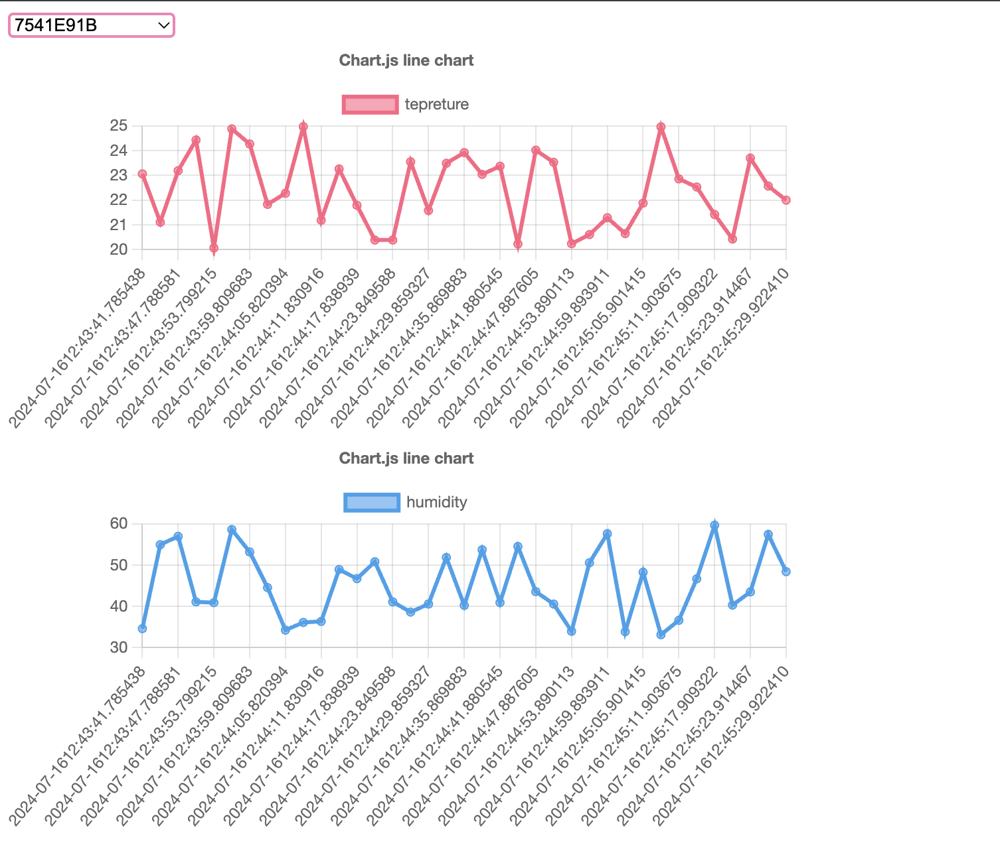

# Project Setup and Run Guide

You can run this project using Docker or on your local machine.

## Running with Docker

To start the project with Docker,first ensure you are on the `docker` branch 

```sh
git checkout docker
```

then run the following command:

```sh
docker-compose up
```

## Running Locally

### Prerequisites

Ensure you are on the `master` branch

```sh
git checkout master
```

And Ensure have the following requirements installed:

#### macOS

Run the following commands to install the required dependencies:

```sh
brew install mosquitto
brew install node
pip install paho-mqtt fastapi uvicorn
```

### Starting the Application

After installing all the requirements, start the application by running:

```sh
./start_app.sh
```

# About the Application

This project consists of three different applications that work together:

- Hub Simulator
- Server
- Dashboard

## Hub Simulator

The Hub Simulator generates different hub IDs and assigns a processor to each one. Each processor generates random values for temperature and humidity sensors, publishing these values to an MQTT broker on a topic corresponding to the hub ID. You can find the code for this application in the `hub` folder.

## Server

The Server application has two main processes:

1. Fetching hub information from the MQTT broker and storing it in the database.
2. Providing a web server that responds to API requests.

You can find the code for this application in the `app` folder.

### Technologies Used

- **Database**: SQLite is used due to its lightweight nature and ease of use and also it provides excellent read performance due to its efficient indexing and storage mechanisms, making it suitable for applications with read-heavy workloads.
- **Web Server**: FastAPI is used for its high performance,readability and simplicity.

## Dashboard

The Dashboard application is implemented using React and Chart.js to visually display hub information. The main features of the dashboard include fetching hub data from the server, selecting a specific hub to view its data, and displaying temperature and humidity trends over time.
You can find the code for this application in the `dashboard` folder.
Here is an example of the dashboard view. 

